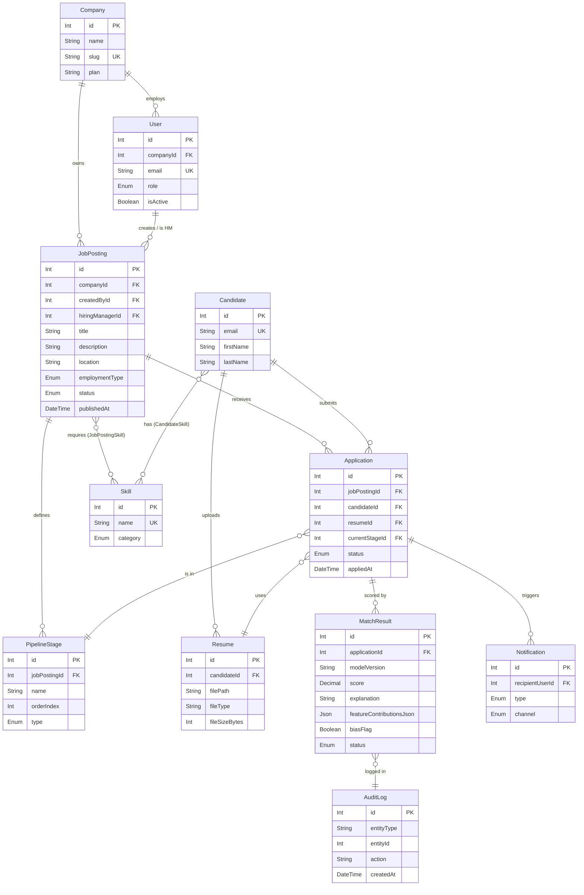

# LTI — Initial User Stories, Backlog & Work Tickets

> **Module 5 · AI4Devs — Effective Planning & Documentation with AI (Part 2)**
> **Author:** RMA (Ricardo Monroy Alvarez)
> **Source PRD:** `LTI-RMA.md` (Module 4 design document)
> **Repo:** `AI4Devs-design-2` · folder `LTI-iniciales/`
> **Date:** June 2026 · **Status:** Initial backlog for delivery

---

## Resumen ejecutivo (Español)

Este documento aterriza el **PRD de LTI** (un ATS nativo de IA, generado en el Módulo 4)
en artefactos accionables de Product Management, actuando como **Product Manager y
Business Analyst**. Contiene cuatro piezas:

1. **Tres User Stories** derivadas de los casos de uso del PRD, escritas con una
   **plantilla común**, validadas contra los criterios **INVEST**, y con sus
   **criterios de aceptación en formato BDD (Given/When/Then)**:
   - **US-1** — El reclutador crea y publica una vacante (`JobPosting`). *Épica: gestión del ciclo de la vacante (UC-1).*
   - **US-2** — El candidato aplica a una vacante y sube su CV (`Resume`). *Épica: gestión del ciclo de la vacante (UC-1).*
   - **US-3** — La IA produce un `MatchResult` explicable para una candidatura. *Épica: cribado asistido por IA (UC-2) — el diferenciador del producto.*

2. **Un slice del modelo de datos** (solo las entidades que tocan estas tres historias),
   con su diagrama entidad-relación en **Mermaid**, alineado con el PRD.

3. **El Backlog de producto** organizado como Épicas → User Stories, priorizado con una
   **tabla multifactor** (Impacto·Urgencia·Complejidad·Riesgos/Dependencias). El orden
   resultante es **US-1 → US-2 → US-3**: la creación de vacantes es la base sin la cual
   nada del producto funciona, tiene baja complejidad y cero dependencias, así que se
   construye primero.

4. **Los tickets de trabajo de la US-1** (la más sencilla para empezar), aterrizados
   técnicamente contra el stack del PRD (Express + Prisma + PostgreSQL · React CRA +
   Bootstrap), cada uno con la plantilla completa del Módulo 5: título, descripción,
   criterios de aceptación, prioridad, asignación, etiquetas, notas, enlaces e historial
   de cambios. *La estimación de esfuerzo se omite por decisión de alcance.*

Los nombres de actores y entidades se mantienen idénticos a los del PRD para trazabilidad.
El cuerpo del documento está en inglés (artefactos técnicos en inglés, según la convención
del proyecto).

---

## Table of Contents

1. [Conventions & Templates](#1--conventions--templates)
2. [User Stories](#2--user-stories)
3. [Data Model (slice)](#3--data-model-slice)
4. [Product Backlog & Prioritization](#4--product-backlog--prioritization)
5. [Work Tickets — US-1](#5--work-tickets--us-1)

---

# 1 · Conventions & Templates

## 1.1 Actors (from PRD §3)

| Actor | Role |
|---|---|
| **Recruiter** | Owns the requisition lifecycle: creates `JobPosting`s, runs screening, schedules interviews. |
| **Hiring Manager** | Defines requirements, reviews shortlist, gives structured evaluations. |
| **Candidate** | Applies, uploads `Resume`, tracks `Application` status. |
| **AI System** | Non-human actor: parses resumes, computes `MatchResult`s, runs bias checks. |

## 1.2 User Story template

Every story below uses this common structure:

```
ID · Title
Epic · Priority

As a <role>, I want <capability>, so that <business value>.

Acceptance Criteria (BDD / Gherkin):
  Scenario: <name>
    Given <context>
    When <action>
    Then <observable outcome>

INVEST evaluation: I/N/V/E/S/T  (✔ each criterion + note)
Notes / Out of scope
```

## 1.3 Work Ticket template (Module 5)

```
Ticket ID · Title
Description · Acceptance Criteria · Priority · Assignment ·
Labels/Tags · Comments/Notes · Links/References · Change History
```
*(Effort estimation field intentionally omitted per delivery scope.)*

---

# 2 · User Stories

## US-1 · Recruiter creates and publishes a JobPosting

**Epic:** Job lifecycle management (UC-1) · **Priority:** Must-have (P0)

> **As a** Recruiter,
> **I want** to create a job posting, configure its hiring pipeline, and publish it,
> **so that** candidates can discover the role and start applying.

### Acceptance Criteria (BDD)

```gherkin
Scenario: Successfully publish a complete job posting
  Given I am authenticated as a Recruiter in an active Company
  And a default PipelineStage template exists
  When I fill in title, description, location, employment type and required skills
  And I select a pipeline template
  And I click "Publish"
  Then the JobPosting is persisted with status PUBLISHED
  And publishedAt is set to the current timestamp
  And its PipelineStages are created from the template

Scenario: Save an incomplete posting as draft
  Given I am authenticated as a Recruiter
  When I fill in only the title and save without publishing
  Then the JobPosting is persisted with status DRAFT
  And it is not visible to Candidates

Scenario: Reject publishing with missing mandatory fields
  Given I am creating a new JobPosting
  When I try to publish without a title or description
  Then the system rejects the request with a 422 validation error
  And it lists every missing mandatory field
  And no JobPosting record is created
```

### INVEST evaluation
- **I — Independent ✔** — needs no other story; only a seeded pipeline template.
- **N — Negotiable ✔** — channel distribution and skill autocomplete are negotiable extras.
- **V — Valuable ✔** — without postings the ATS has no inventory; direct recruiter value.
- **E — Estimable ✔** — bounded CRUD + status transition; well-understood.
- **S — Small ✔** — fits one sprint; decomposed into 5 tickets in §5.
- **T — Testable ✔** — every scenario maps to an automated test (DB state + 422 path).

### Notes / Out of scope
Multi-channel job-board distribution and AI skill autocomplete are **out of scope** for
this story (future stories). v1 publishes to the internal candidate portal only.

---

## US-2 · Candidate applies to a JobPosting and uploads a Resume

**Epic:** Job lifecycle management (UC-1) · **Priority:** Must-have (P0)

> **As a** Candidate,
> **I want** to apply to a published job posting and upload my resume,
> **so that** I can be considered for the role and track my application.

### Acceptance Criteria (BDD)

```gherkin
Scenario: Successful application with a valid resume
  Given a JobPosting exists with status PUBLISHED
  And I am a Candidate viewing that posting
  When I submit my contact details and upload a PDF resume under 10 MB
  Then an Application is created in the first PipelineStage with status APPLIED
  And the Resume file is stored and linked to my Candidate profile
  And the Recruiter receives a Notification of the new application

Scenario: Reject an invalid resume format
  Given I am applying to a PUBLISHED JobPosting
  When I upload a file that is not PDF or DOCX, or larger than 10 MB
  Then the upload is rejected with a clear error message
  And no Application is created

Scenario: Link a duplicate candidate by email
  Given a Candidate already exists with my email address
  When I apply to a new JobPosting
  Then the new Application is linked to my existing Candidate profile
  And no duplicate Candidate record is created
```

### INVEST evaluation
- **I — Independent ◐** — logically depends on US-1 (a posting must exist); acceptable as the natural next slice.
- **N — Negotiable ✔** — duplicate-detection rule and notification channel are negotiable.
- **V — Valuable ✔** — without applications there is nothing to screen.
- **E — Estimable ✔** — CRUD + file upload + one uniqueness rule.
- **S — Small ✔** — single sprint.
- **T — Testable ✔** — happy path, format-rejection and dedupe each have explicit outcomes.

### Notes / Out of scope
Candidate authentication/portal accounts and communication history are out of scope here;
v1 captures contact details inline with the application.

---

## US-3 · AI produces an explainable MatchResult for an Application

**Epic:** AI-assisted screening & matching (UC-2) — *product differentiator* · **Priority:** Should-have (P1)

> **As a** Recruiter,
> **I want** the AI System to score each application against the job and explain the score,
> **so that** I can shortlist candidates faster while keeping every AI decision auditable.

### Acceptance Criteria (BDD)

```gherkin
Scenario: Score a new application with an explanation
  Given an Application exists with a parsed Resume
  And its JobPosting has structured required Skills
  When the AI System runs the screening pipeline
  Then a MatchResult is persisted with a 0–100 score
  And it carries modelVersion, featureContributions and a human-readable explanation
  And an immutable AuditLog entry (action MATCH_COMPUTED) is written in the same transaction

Scenario: Flag insufficient data
  Given an Application whose Resume failed to parse
  When the AI System runs screening
  Then the MatchResult status is INSUFFICIENT_DATA
  And no numeric score is shown to the Recruiter

Scenario: Bias check hides a flagged score
  Given the bias check detects a sensitive-attribute proxy
  When the MatchResult is computed
  Then biasFlag is set to true
  And the score is hidden in the UI
  And an Admin-visible alert is raised
```

### INVEST evaluation
- **I — Independent ◐** — depends on US-1 and US-2 having produced data; isolated once data exists.
- **N — Negotiable ✔** — the exact scoring model and bias heuristics are negotiable.
- **V — Valuable ✔** — this is LTI's core competitive advantage (explainable AI).
- **E — Estimable ◐** — estimable but larger; the LLM Gateway and pgvector add complexity.
- **S — Small ✖** — borderline too big; in real planning this would be split into sub-stories (parse, embed, score, explain, bias). Kept whole here to show the epic.
- **T — Testable ✔** — deterministic LLM stub makes scenarios reproducible.

### Notes / Out of scope
Offline model retraining and the recruiter override flow are separate stories (UC-2 A4).

---

# 3 · Data Model (slice)

Only the entities touched by US-1, US-2 and US-3 are shown. Names, types and relations
match `LTI-RMA.md` §4. Junction tables `JobPostingSkill` and `CandidateSkill` implement
the N:M relations to `Skill`.



---

# 4 · Product Backlog & Prioritization

## 4.1 Backlog hierarchy (Agile)

```
Product Roadmap — LTI v1
│
├── EPIC A · Job Lifecycle Management (UC-1)
│     ├── US-1 · Recruiter creates and publishes a JobPosting        [P0]
│     └── US-2 · Candidate applies and uploads a Resume              [P0]
│
└── EPIC B · AI-Assisted Screening & Matching (UC-2)
      └── US-3 · AI produces an explainable MatchResult              [P1]
```

## 4.2 Multi-factor prioritization table

Each story is rated **Low / Medium / High** on four factors (Module 5 method). The
priority follows from high impact + high urgency + low complexity + low risk.

| User Story | User Impact & Business Value | Urgency | Complexity & Effort | Risks & Dependencies | → Priority |
|---|---|---|---|---|---|
| **US-1** · Create & publish JobPosting | **High** — no postings, no product | **High** — foundational inventory | **Low** — CRUD + status transition | **Low** — no upstream dependencies | **1st (P0)** |
| **US-2** · Apply & upload Resume | **High** — no applications, nothing to screen | **High** — completes the intake loop | **Medium** — file upload + dedupe rule | **Medium** — depends on US-1 | **2nd (P0)** |
| **US-3** · Explainable MatchResult | **High** — core differentiator | **Medium** — valuable but not blocking intake | **High** — LLM Gateway, pgvector, bias check | **High** — depends on US-1 + US-2 + AI infra | **3rd (P1)** |

## 4.3 Rationale

The ordering is dependency- and risk-driven rather than value-driven alone. All three
stories carry **high business value**, so value cannot break the tie. What separates them
is the combination of **urgency, complexity and dependencies**:

- **US-1 goes first** because it is the only story with **no upstream dependency** and the
  **lowest complexity**, yet it unlocks everything else — there is no candidate intake and
  no AI screening until a `JobPosting` exists. It is the safest, fastest path to a working
  vertical slice, which is exactly why its tickets are detailed in §5.
- **US-2 goes second**: equally urgent (it closes the intake loop) but it **depends on US-1**
  and adds file-upload complexity, so it cannot precede it.
- **US-3 goes last**: it is the product's flagship differentiator, but it is the **most
  complex** (AI pipeline, vector store, bias check) and **depends on both** prior stories
  having produced real data. Sequencing it last contains technical risk and lets the team
  validate the data foundation before layering AI on top.

---

# 5 · Work Tickets — US-1

US-1 (*Recruiter creates and publishes a JobPosting*) is decomposed into 5 work tickets,
ordered by execution. Each follows the Module 5 ticket template. Effort estimation is
omitted per scope. Stack target: **Express + Prisma + PostgreSQL · React CRA + Bootstrap**.

---

### TCK-01 · Define Prisma schema & migration for JobPosting domain

- **Description** — Add the `JobPosting`, `PipelineStage`, `Skill` and `JobPostingSkill`
  models to `schema.prisma` exactly as typed in PRD §4, including the `EmploymentType` and
  `JobStatus` enums and the `PipelineStageType` enum. Generate and run the migration.
- **Acceptance Criteria**
  - `npx prisma migrate dev` creates the four tables with the correct columns, FKs and the unique constraint on `Skill.name`.
  - `JobPosting.status` defaults to `DRAFT`; `JobPostingSkill` enforces a composite PK `(jobPostingId, skillId)`.
  - `npx prisma generate` produces a typed client with no errors.
- **Priority** — P0 (blocker for all other US-1 tickets).
- **Assignment** — Backend.
- **Labels/Tags** — `backend`, `prisma`, `schema`, `migration`, `US-1`.
- **Comments/Notes** — Reuse exact field names from the PRD ER diagram to keep the data model authoritative. No data seeding here (see TCK-03).
- **Links/References** — PRD `LTI-RMA.md` §4.2 (ER diagram); §3 below in this doc.
- **Change History** — `2026-06-02` Created (RMA).

---

### TCK-02 · Backend — Create JobPosting endpoint with validation

- **Description** — Implement `POST /api/job-postings` in Express. Validate the request body
  with **Zod** (title, description, location, employmentType, salary range, requiredSkillIds).
  Persist a `JobPosting` with status `DRAFT` and link the required skills via `JobPostingSkill`.
- **Acceptance Criteria**
  - A valid body returns `201` with the created `JobPosting` (status `DRAFT`) and its linked skills.
  - A body missing a mandatory field returns `422` listing every missing field; no record is created (DB state restored in test).
  - The handler is fully typed; the Zod schema is the single source of validation.
- **Priority** — P0.
- **Assignment** — Backend.
- **Labels/Tags** — `backend`, `express`, `zod`, `validation`, `US-1`.
- **Comments/Notes** — Two-line comment above the Express router explaining middleware order for non-JS-native reviewer (RMA). Restore DB state after CREATE in tests.
- **Links/References** — US-1 scenario "Save as draft" and "Reject with missing fields".
- **Change History** — `2026-06-02` Created (RMA).

---

### TCK-03 · Backend — Publish endpoint & pipeline template seeding

- **Description** — Implement `POST /api/job-postings/:id/publish`. Transition status
  `DRAFT → PUBLISHED`, set `publishedAt`, and create `PipelineStage` rows from the selected
  template (seed a default template if none exists). Reject publishing if mandatory fields
  are incomplete.
- **Acceptance Criteria**
  - Publishing a complete draft returns `200`, sets `status=PUBLISHED` and `publishedAt`, and creates the template's `PipelineStage`s in correct `orderIndex`.
  - Publishing an incomplete posting returns `422` and leaves status unchanged.
  - An `AuditLog` row records the publish action.
- **Priority** — P0.
- **Assignment** — Backend.
- **Labels/Tags** — `backend`, `express`, `state-transition`, `seeding`, `US-1`.
- **Comments/Notes** — Status transition is the core of the "Publish" scenario; keep it idempotent (re-publishing a PUBLISHED posting is a no-op `200`).
- **Links/References** — US-1 scenario "Successfully publish"; PRD UC-1 postconditions.
- **Change History** — `2026-06-02` Created (RMA).

---

### TCK-04 · Frontend — JobPosting creation form

- **Description** — Build a React (CRA) form styled with Bootstrap to create a `JobPosting`:
  fields for title, description, location, employment type, salary range and required skills
  (multi-select). Inline validation, loading spinner on submit, toast on success/error.
- **Acceptance Criteria**
  - Submitting a valid form calls `POST /api/job-postings` and shows a success toast; the new draft appears in the list.
  - Inline errors render for each invalid field before submit is enabled.
  - A spinner shows during the request; errors from the API surface as a toast.
- **Priority** — P1 (after backend endpoints exist).
- **Assignment** — Frontend.
- **Labels/Tags** — `frontend`, `react`, `cra`, `bootstrap`, `form`, `US-1`.
- **Comments/Notes** — Two-line comment above the `useState`/`onChange` hooks explaining JSX state for non-JS-native reviewer (RMA). No form libraries — controlled components only.
- **Links/References** — TCK-02 endpoint contract; US-1 "Save as draft" scenario.
- **Change History** — `2026-06-02` Created (RMA).

---

### TCK-05 · Frontend — Publish action & postings list

- **Description** — Add a postings list view and a "Publish" action that calls the publish
  endpoint, then reflects the new `PUBLISHED` status and `publishedAt` in the UI. Disable the
  action for incomplete drafts.
- **Acceptance Criteria**
  - The list shows each posting's status badge (`DRAFT`/`PUBLISHED`).
  - Clicking "Publish" on a complete draft calls `POST /:id/publish`, shows a success toast and updates the badge without a full reload.
  - The "Publish" button is disabled (with tooltip) for drafts missing mandatory fields.
- **Priority** — P1.
- **Assignment** — Frontend.
- **Labels/Tags** — `frontend`, `react`, `cra`, `bootstrap`, `US-1`.
- **Comments/Notes** — Optimistic UI optional; if used, roll back on API error.
- **Links/References** — TCK-03 endpoint contract; US-1 "Successfully publish" scenario.
- **Change History** — `2026-06-02` Created (RMA).

---

*End of document. — RMA, June 2026.*
